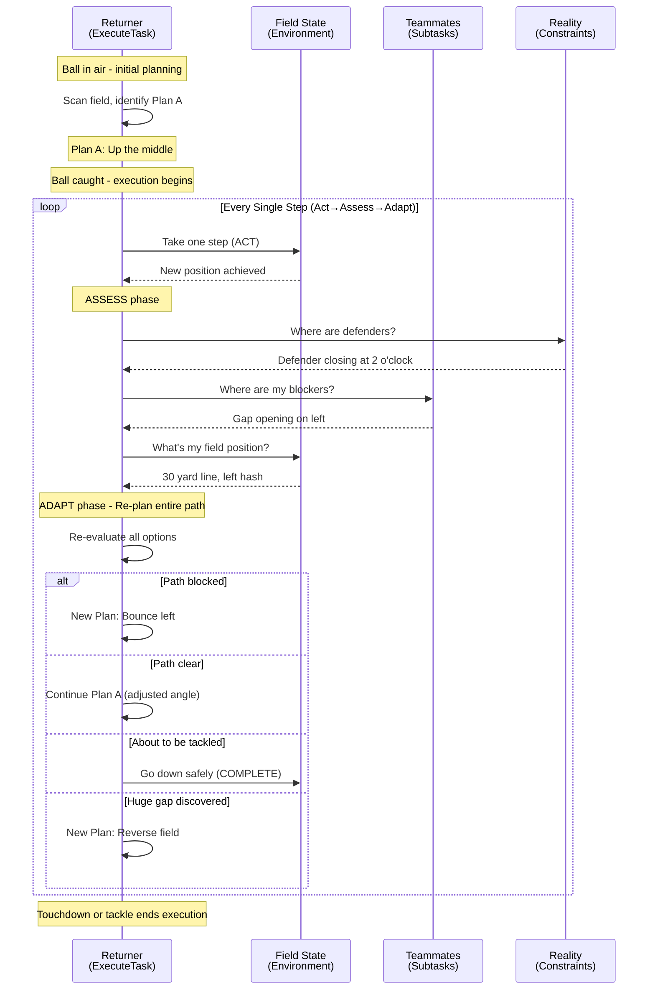
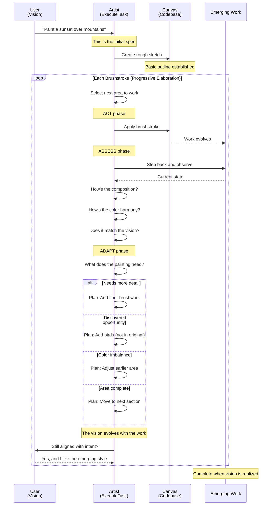
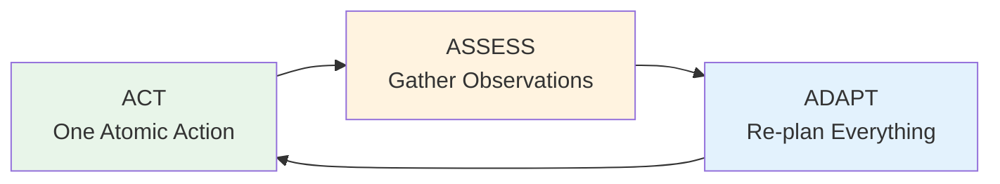

# Execution Flow Metaphors - Continuous Re-planning Architecture

## Context

This document captures the fundamental execution philosophy of the Task Execution Framework (TEF) through two key metaphors. The TEF is a control system that maximizes execution robustness through continuous re-planning and progressive elaboration, rather than requiring perfect upfront specifications.

<details>
<summary>💡 <strong>Why These Metaphors Matter</strong></summary>

Traditional execution models follow a linear path: Plan → Execute → Verify. Our framework embraces a different philosophy: every action reveals information that improves the next action. These metaphors help visualize how continuous adaptation isn't a fallback strategy - it IS the strategy.

**🎯 ELI5:** Instead of following a recipe exactly, you taste as you cook and adjust. Instead of following GPS blindly, you look at traffic and adjust your route. The framework works the same way - it gets smarter with every step.
</details>

## Core Principle: Continuous Re-planning

```python
def the_fundamental_principle():
    """
    THE CORE INSIGHT:
    We re-evaluate the entire plan after EVERY atomic action.
    This is not a failure mode - this IS the mode.
    """
    
    traditional_execution = "Plan → Execute All → Check Success"
    
    our_execution = """
        Fuzzy Initial Plan →
        Execute One Atom →
        Re-evaluate ENTIRE Remaining Plan →
        Execute Next Atom →
        Re-evaluate ENTIRE Remaining Plan →
        ... (repeat until complete)
    """
    
    return "Each execution reveals information that makes the next plan better"
```

<details>
<summary>🔄 <strong>Understanding Continuous Re-planning</strong></summary>

This is the heart of the framework. Unlike traditional systems that create a detailed plan and try to execute it perfectly, we expect and embrace change. Every single action we take teaches us something, and we immediately use that knowledge to improve our approach.

**🔄 ELI5:** Like walking through a dark room with a flashlight. Each step forward reveals more of the room, and you adjust your path based on what you see. You don't need to map the entire room before starting - you figure it out as you go.
</details>

## Metaphor 1: Football Kickoff Return

The kickoff returner embodies continuous re-planning. They have an initial plan before catching the ball, but they re-evaluate and adjust with literally every step based on the changing field.

### Sequence Diagram



### Implementation

```python
class KickoffReturn:
    """
    Models our ExecuteTask function through football metaphor.
    Key insight: The returner re-plans with EVERY STEP.
    """
    
    def execute_return(self, initial_field_state):
        """
        This is our ExecuteTask - single entry point for all complexity
        """
        # Initial planning (reading the task spec)
        position = self.catch_ball_position
        initial_plan = self.scan_field_and_plan(initial_field_state)
        current_plan = initial_plan
        attempt = 0
        
        while not self.is_down() and not self.scored_touchdown():
            attempt += 1
            
            # ========== ACT PHASE ==========
            # Execute exactly ONE step of current plan
            new_position = self.take_single_step(current_plan.next_move)
            self.commit_step(f"Attempt {attempt}: moved to {new_position}")
            
            # ========== ASSESS PHASE ==========
            # Gather observations from multiple perspectives
            observations = self.parallel_assess([
                self.observe_defenders(new_position),    # Like build_observer
                self.observe_blockers(new_position),      # Like integration_observer
                self.observe_field_position(new_position), # Like requirements_observer
                self.observe_momentum()                   # Like quality_observer
            ])
            
            # ========== ADAPT PHASE ==========
            # THE KEY: Complete re-planning based on current reality
            current_plan = self.navigator_replan(
                original_goal="endzone",
                current_state={
                    "position": new_position,
                    "observations": observations,
                    "attempt": attempt
                },
                previous_plan=current_plan
            )
            
            # Commit the adapted plan
            self.commit_plan(f"Attempt {attempt}: {current_plan.decision}")
        
        return self.calculate_result()
    
    def navigator_replan(self, original_goal, current_state, previous_plan):
        """
        This is our Navigator - makes strategic decisions.
        Consults multiple strategists for robust decision-making.
        """
        
        # Multiple strategist perspectives
        strategies = {
            "aggressive": self.find_fastest_path_to_endzone(current_state),
            "conservative": self.find_safest_yards(current_state),
            "opportunistic": self.exploit_biggest_gap(current_state),
            "risk_aware": self.avoid_fumble_situations(current_state)
        }
        
        # Synthesize into decision
        if self.imminent_tackle(current_state):
            return Plan(decision="COMPLETE", action="go_down")
            
        elif strategies["aggressive"].is_clear():
            return Plan(decision="CONTINUE", action="accelerate", 
                       path=strategies["aggressive"].path)
                       
        elif strategies["opportunistic"].has_gap():
            return Plan(decision="REFINE", action="cut",
                       direction=strategies["opportunistic"].direction)
                       
        elif self.field_congested(current_state):
            return Plan(decision="DECOMPOSE", action="juke_sequence",
                       subtasks=["fake_left", "cut_right", "accelerate"])
                       
        else:
            return Plan(decision="CONTINUE", action="maintain_course",
                       adjustment="minor_angle_change")
```

<details>
<summary>🏈 <strong>What This Teaches Us</strong></summary>

The kickoff return shows us that:
1. **Planning happens continuously** - not just at the beginning
2. **Every action provides new information** - each step reveals the field differently  
3. **Multiple perspectives matter** - like having different strategists
4. **Adaptation is normal** - changing plans isn't failure, it's intelligence
5. **Commitment is incremental** - we commit each step, not the entire path

**🏈 ELI5:** The runner doesn't decide their entire path before catching the ball. They decide one step at a time, and each step helps them decide the next one better. That's exactly how our framework operates.
</details>

## Metaphor 2: Progressive Painting (Not Paint-by-Numbers)

An artist creating an original painting starts with a rough sketch and progressively adds detail. The painting itself teaches the artist what it needs - each brushstroke reveals possibilities for the next one.

### Sequence Diagram



### Implementation

```python
class ProgressivePainting:
    """
    Models our ExecuteTask through artistic creation.
    Key insight: The work reveals what it needs next.
    """
    
    def create_painting(self, initial_vision):
        """
        This is our ExecuteTask for a project/task hierarchy.
        The initial vision is the user's task specification.
        """
        
        # Initial sketch (task decomposition)
        canvas = Canvas()
        canvas.rough_sketch = self.interpret_vision(initial_vision)
        
        # The vision will evolve as we paint
        current_vision = initial_vision
        brushstroke_count = 0
        
        while not self.painting_complete(canvas, current_vision):
            brushstroke_count += 1
            
            # ========== ACT PHASE ==========
            # Select area and apply paint
            area = self.select_next_area(canvas, current_vision)
            
            if area.needs_subtasks():
                # Parent task orchestrating subtasks
                result = self.orchestrate_detail_work(area)
            else:
                # Leaf task doing actual work
                result = self.apply_brushstroke(area, current_vision)
            
            canvas.update(area, result)
            self.commit_progress(f"Stroke {brushstroke_count}: {area}")
            
            # ========== ASSESS PHASE ==========
            # Multiple perspectives on the work
            observations = {
                "composition": self.assess_overall_balance(canvas),
                "color_harmony": self.check_color_relationships(canvas),
                "detail_level": self.evaluate_detail_needed(area),
                "vision_alignment": self.compare_to_vision(canvas, current_vision),
                "emergent_properties": self.notice_opportunities(canvas)
            }
            
            # ========== ADAPT PHASE ==========
            # Let the painting tell us what it needs
            decision = self.artistic_navigator(
                observations, 
                canvas, 
                current_vision
            )
            
            if decision.type == "REFINE":
                # Current area needs more work
                area.refinement_plan = decision.details
                
            elif decision.type == "DECOMPOSE":
                # Area too complex, break into smaller strokes
                area.subtasks = decision.create_subtasks()
                
            elif decision.type == "EVOLVE_VISION":
                # The painting revealed new possibilities
                current_vision = self.elaborate_vision(
                    current_vision,
                    canvas.emergent_properties
                )
                self.commit_vision(f"Vision evolved: {current_vision.delta}")
                
            elif decision.type == "REBALANCE":
                # Earlier work needs adjustment based on new work
                canvas.areas_to_revisit.append(decision.area)
                
            elif decision.type == "COMPLETE":
                # This area is finished
                area.mark_complete()
        
        return canvas
    
    def elaborate_vision(self, original_vision, emergent_properties):
        """
        Critical: The vision EVOLVES based on what we discover.
        This models how our task specs evolve during execution.
        """
        
        elaborated_vision = original_vision.copy()
        
        for property in emergent_properties:
            if property.enhances(original_vision):
                elaborated_vision.incorporate(property)
                # Like: "Oh, adding a bird here would perfect the composition"
                # Or: "This error handling pattern would improve robustness"
        
        # We maintain alignment with original intent
        assert elaborated_vision.satisfies(original_vision.core_intent)
        
        return elaborated_vision
```

<details>
<summary>🎨 <strong>What This Teaches Us</strong></summary>

The painting metaphor shows us that:
1. **Specifications are sketches** - starting points, not blueprints
2. **Work reveals requirements** - you discover needs by doing
3. **Vision evolves with execution** - the plan gets better as you work
4. **Earlier work may need revision** - based on what you learn later
5. **Completion is recognized, not predetermined** - you know it when you see it

**🎨 ELI5:** You can't plan every brushstroke before starting a painting. Each stroke you make shows you what the next one should be. The painting "tells you" what it needs. Our framework works the same way with code.
</details>

## The Environment: Concrete Definition

```python
class Environment:
    """
    The concrete runtime context that evolves with execution.
    Simple structure, but captures discovered knowledge.
    """
    
    def __init__(self, base_dir: Path):
        # Static context (what we know at start)
        self.base_dir = base_dir          # Required by Claude SDK
        self.working_dir = base_dir       # Can change during execution
        self.git_root = self._find_git_root()
        
        # Discovered context (what we learn by doing)
        self.discovered_constraints = []   # Things we learned the hard way
        self.successful_patterns = []      # Things that worked
        self.dependency_graph = {}         # Relationships we discovered
        self.execution_history = []        # Our trail of breadcrumbs
        
        # Available capabilities
        self.detected_tools = self._scan_for_tools()
        self.language_context = self._detect_languages()
        self.framework_context = self._detect_frameworks()
    
    def learn_from_execution(self, execution_result):
        """
        THE KEY: Environment gets smarter with each execution
        """
        self.execution_history.append(execution_result)
        
        if execution_result.succeeded:
            self.successful_patterns.append(
                extract_pattern(execution_result)
            )
        else:
            self.discovered_constraints.append(
                extract_constraint(execution_result.error)
            )
        
        # Update our understanding
        if execution_result.revealed_dependencies:
            self.dependency_graph.update(execution_result.dependencies)
    
    def provide_context_for_decision(self):
        """
        What the Navigator needs to make smart decisions
        """
        return {
            "where_we_are": self.working_dir,
            "what_we_'ve_learned": self.discovered_constraints,
            "what_works": self.successful_patterns,
            "recent_history": self.execution_history[-5:],
            "available_tools": self.detected_tools
        }
```

<details>
<summary>🌍 <strong>Understanding the Environment</strong></summary>

The Environment is not just a static configuration - it's a living context that learns and evolves. It starts simple (just a directory) but accumulates knowledge with every action. This learned context informs better decisions over time.

**🌍 ELI5:** Like how you learn a new neighborhood. At first you just know your address. But as you explore, you learn which streets connect, where the shortcuts are, which coffee shop is best. The environment "remembers" what it learns.
</details>

## How These Metaphors Connect

```python
def synthesis():
    """
    Both metaphors teach the same lesson from different angles
    """
    
    common_principles = {
        "Continuous Re-planning": {
            "football": "Re-evaluate path with every step",
            "painting": "Each brushstroke informs the next"
        },
        
        "Progressive Elaboration": {
            "football": "Path becomes clearer as you advance",
            "painting": "Details emerge through the work"
        },
        
        "Multiple Perspectives": {
            "football": "Different strategists for robust decisions",
            "painting": "Composition, color, vision, opportunity"
        },
        
        "Adaptation is Normal": {
            "football": "Changing direction isn't failure",
            "painting": "Revising earlier work is part of the process"
        },
        
        "Reality Teaches": {
            "football": "The field shows you the path",
            "painting": "The canvas tells you what it needs"
        }
    }
    
    return common_principles
```

## Act → Assess → Adapt: The Universal Pattern

Both metaphors follow the same three-phase cycle:



### In Football Terms:
- **Act**: Take one step
- **Assess**: Where are defenders/blockers/gaps?
- **Adapt**: Choose next step based on entire field

### In Painting Terms:
- **Act**: Apply one brushstroke
- **Assess**: How does it look? What emerged?
- **Adapt**: Decide next stroke based on whole painting

### In Framework Terms:
- **Act**: Execute one task (leaf) or orchestrate (parent)
- **Assess**: Run observers for multiple perspectives
- **Adapt**: Navigator re-plans based on discoveries

<details>
<summary>♻️ <strong>The Cycle That Drives Everything</strong></summary>

This three-phase cycle is the heartbeat of the framework. It runs at every level - from individual code changes to entire project orchestration. The key insight is that Adapt doesn't just fix problems - it improves the plan based on new information.

**♻️ ELI5:** Like learning to ride a bike: try (Act) → see what happened (Assess) → adjust your balance (Adapt) → try again. You don't plan all your balance adjustments in advance - you figure them out as you go.
</details>

## Implications for Implementation

```python
def key_implementation_insights():
    """
    What these metaphors mean for our code
    """
    
    return {
        "Single Entry Point": """
            ExecuteTask() handles everything - just like the returner
            catches every kickoff the same way, or the artist approaches
            every painting with the same process.
        """,
        
        "Recursive Structure": """
            Parent tasks orchestrate, leaf tasks execute.
            Like painting: large areas decompose into smaller strokes,
            each following the same Act→Assess→Adapt cycle.
        """,
        
        "Plan Evolution": """
            Task specifications are living documents that improve
            through execution, like how the painting's vision evolves
            as the artist works.
        """,
        
        "Failure is Information": """
            The returner learns from being tackled.
            The painter learns from color that doesn't work.
            Our framework learns from every error.
        """,
        
        "Observers Don't Judge": """
            They report what they see, like scouts reporting defender
            positions. The Navigator (coach/artist) makes decisions.
        """,
        
        "Local Adaptation": """
            Each level handles its own challenges. The returner
            adjusts their path; they don't stop to redesign the play.
        """
    }
```

## Summary: The Philosophy

The Task Execution Framework embodies a philosophy of **continuous adaptation through progressive discovery**. Rather than trying to plan perfectly upfront, we:

1. Start with a rough plan (the kickoff play design / the initial sketch)
2. Execute atomically (one step / one brushstroke)
3. Learn from what happens (field position / how the painting looks)
4. Re-plan the entire remainder (new path / next areas to paint)
5. Repeat until complete

This is not a fallback strategy for when things go wrong. This IS the strategy. Every execution teaches us something that makes the next execution better.

<details>
<summary>🎯 <strong>The Bottom Line</strong></summary>

Perfect planning is impossible because you don't know what you don't know. But perfect adaptation is achievable because each action teaches you something. Our framework maximizes robustness not through better planning, but through better adaptation.

**🎯 ELI5:** You can't know exactly how to build something until you start building it. But if you pay attention and adjust as you go, you'll end up building something great. That's what this framework does - it pays attention and adjusts continuously.
</details>

## Next Steps

With these metaphors as our guide, we can:
1. Design the concrete `ExecuteTask` implementation
2. Define the Navigator's strategist architecture  
3. Specify the Observer interfaces
4. Build the continuous re-planning mechanics

The metaphors aren't just explanatory tools - they're design patterns that inform every architectural decision.