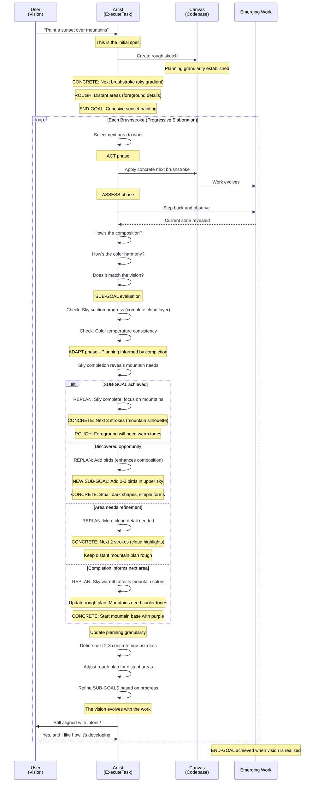
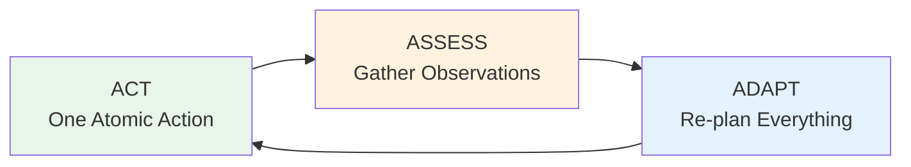

# Execution Flow Metaphors - Continuous Re-planning Architecture

## Context

This document captures the fundamental execution philosophy of the Task Execution Framework (TEF) through two key metaphors. The TEF is a control system that maximizes execution robustness through continuous re-planning and progressive elaboration, rather than requiring perfect upfront specifications.

💡 <strong>Why These Metaphors Matter</strong>

Traditional execution models follow a linear path: Plan → Execute → Verify. Our framework embraces a different philosophy: every action reveals information that improves the next action. These metaphors help visualize how continuous adaptation isn't a fallback strategy - it IS the strategy.

**🎯 ELI5:** Instead of following a recipe exactly, you taste as you cook and adjust. Instead of following GPS blindly, you look at traffic and adjust your route. The framework works the same way - it gets smarter with every step.

## Core Principle: Continuous Re-planning

The fundamental insight is that we re-evaluate the entire plan after EVERY atomic action. This is not a failure mode - this IS the mode. Traditional execution follows "Plan → Execute All → Check Success", but our execution follows:

- Start with fuzzy initial plan
- Execute one atomic action
- Re-evaluate ENTIRE remaining plan
- Execute next atomic action
- Re-evaluate ENTIRE remaining plan
- Repeat until complete

Each execution reveals information that makes the next plan better.

🔄 <strong>Understanding Continuous Re-planning</strong>

This is the heart of the framework. Unlike traditional systems that create a detailed plan and try to execute it perfectly, we expect and embrace change. Every single action we take teaches us something, and we immediately use that knowledge to improve our approach.

**🔄 ELI5:** Like walking through a dark room with a flashlight. Each step forward reveals more of the room, and you adjust your path based on what you see. You don't need to map the entire room before starting - you figure it out as you go.

## Metaphor 1: Football Kickoff Return

The kickoff returner embodies continuous re-planning. They have an initial plan before catching the ball, but they re-evaluate and adjust with literally every step based on the changing field.

### Sequence Diagram

🏈 <strong>What This Teaches Us</strong>

```mermaid
sequenceDiagram
    participant Returner as Returner<br/>(ExecuteTask)
    participant Field as Field State<br/>(Environment)
    participant Blockers as Teammates<br/>(Subtasks)
    participant Defense as Reality<br/>(Constraints)
    
    Note over Returner: Ball in air - initial planning with granularity
    Returner->>Returner: CONCRETE: Next 3 steps (catch, step right, assess)
    Note over Returner: ROUGH: General direction (aim for sideline)
    Note over Returner: END-GOAL: Score touchdown (win game)
    
    Note over Returner: Ball caught - execution begins
    
    loop Every Single Step (Act→Assess→Adapt)
        Returner->>Field: Take one step (ACT)
        Field-->>Returner: New position achieved
        
        Note over Returner: ASSESS phase
        Returner->>Defense: Where are defenders?
        Defense-->>Returner: Defender closing at 2 o'clock
        Returner->>Blockers: Where are my blockers?
        Blockers-->>Returner: Gap opening on left
        Returner->>Field: What's my field position?
        Field-->>Returner: 30 yard line, left hash
        
        Note over Returner: SUB-GOAL evaluation
        Returner->>Returner: Check: Get to 35-yard line (first down)
        Returner->>Returner: Check: Improve field position
        
        Note over Returner: ADAPT phase - Risk/reward re-planning
        Returner->>Returner: Risk: High tackle probability if continue
        Returner->>Returner: Reward: Potential 15-yard gain if gap holds
        
        alt High risk, low reward
            Returner->>Returner: REPLAN: Go down safely (SUB-GOAL achieved)
            Note over Returner: CONCRETE next 2 steps: Secure ball, fall forward
        else Low risk, high reward
            Returner->>Returner: REPLAN: Exploit gap aggressively
            Note over Returner: CONCRETE next 3 steps: Cut left, accelerate, protect ball
            Note over Returner: ROUGH: Continue to sideline if gap closes
        else Opportunity discovered
            Returner->>Returner: REPLAN: Reverse field completely
            Note over Returner: NEW SUB-GOAL: Get to far sideline
            Note over Returner: CONCRETE next 4 steps: Plant, pivot, sprint, scan
        end
        
        Note over Returner: Update planning granularity
        Returner->>Returner: Refine next 3 concrete steps
        Returner->>Returner: Adjust distant rough plan based on new info
    end
    
    Note over Returner: END-GOAL achieved or SUB-GOAL completed
```

The kickoff return shows us that:
1. **Planning happens continuously** - not just at the beginning
2. **Every action provides new information** - each step reveals the field differently  
3. **Multiple perspectives matter** - like having different strategists
4. **Adaptation is normal** - changing plans isn't failure, it's intelligence
5. **Commitment is incremental** - we commit each step, not the entire path

**🏈 ELI5:** The runner doesn't decide their entire path before catching the ball. They decide one step at a time, and each step helps them decide the next one better. That's exactly how our framework operates.

## Metaphor 2: Progressive Painting (Not Paint-by-Numbers)

An artist creating an original painting starts with a rough sketch and progressively adds detail. The painting itself teaches the artist what it needs - each brushstroke reveals possibilities for the next one.

### Sequence Diagram

🎨 <strong>What This Teaches Us</strong>

The painting metaphor shows us that:
1. **Specifications are sketches** - starting points, not blueprints
2. **Work reveals requirements** - you discover needs by doing
3. **Vision evolves with execution** - the plan gets better as you work
4. **Earlier work may need revision** - based on what you learn later
5. **Completion is recognized, not predetermined** - you know it when you see it

**🎨 ELI5:** You can't plan every brushstroke before starting a painting. Each stroke you make shows you what the next one should be. The painting "tells you" what it needs. Our framework works the same way with code.

## The Environment: Learning Context

The Environment is the concrete runtime context that evolves with execution. It has a simple structure but captures discovered knowledge:

**Static Context** (what we know at start):
- Base directory (required by Claude SDK)
- Working directory (can change during execution)
- Git root location

**Discovered Context** (what we learn by doing):
- Things we learned the hard way (discovered constraints)
- Things that worked (successful patterns)
- Relationships we discovered (dependency graph)
- Our trail of breadcrumbs (execution history)

**Available Capabilities**:
- Detected tools, languages, and frameworks

The key insight is that the Environment gets smarter with each execution, learning from both successes and failures to inform better decisions over time.

🌍 <strong>Understanding the Environment</strong>

The Environment is not just a static configuration - it's a living context that learns and evolves. It starts simple (just a directory) but accumulates knowledge with every action. This learned context informs better decisions over time.

**🌍 ELI5:** Like how you learn a new neighborhood. At first you just know your address. But as you explore, you learn which streets connect, where the shortcuts are, which coffee shop is best. The environment "remembers" what it learns.

## How These Metaphors Connect

Both metaphors teach the same lesson from different angles:

**Continuous Re-planning**:
- Football: Re-evaluate path with every step
- Painting: Each brushstroke informs the next

**Progressive Elaboration**:
- Football: Path becomes clearer as you advance
- Painting: Details emerge through the work

**Planning Granularity**:
- Football: Concrete next 3 steps, rough distant direction
- Painting: Concrete next brushstroke, rough idea for distant areas

**Sub-goals vs End-goals**:
- Football: First down/field position vs win game
- Painting: Complete sky section vs cohesive painting

**Multiple Perspectives**:
- Football: Different strategists for robust decisions
- Painting: Composition, color, vision, opportunity

**Risk/Reward Re-planning**:
- Football: Evaluate tackle risk vs yard gain potential
- Painting: Balance detail effort vs overall composition needs

**Adaptation is Normal**:
- Football: Changing direction isn't failure
- Painting: Revising earlier work is part of the process

**Reality Teaches**:
- Football: The field shows you the path
- Painting: The canvas tells you what it needs

## Act → Assess → Adapt: The Universal Pattern

Both metaphors follow the same three-phase cycle:

### In Football Terms:
- **Act**: Take one step
- **Assess**: Where are defenders/blockers/gaps?
- **Adapt**: Choose next step based on entire field

### In Painting Terms:
- **Act**: Apply one brushstroke
- **Assess**: How does it look? What emerged?
- **Adapt**: Decide next stroke based on whole painting

### In Framework Terms:
- **Act**: Execute one task (leaf) or orchestrate (parent)
- **Assess**: Run observers for multiple perspectives
- **Adapt**: Navigator re-plans based on discoveries, with concrete near-term steps and rough distant plans

♻️ <strong>The Cycle That Drives Everything</strong>

This three-phase cycle is the heartbeat of the framework. It runs at every level - from individual code changes to entire project orchestration. The key insight is that Adapt doesn't just fix problems - it improves the plan based on new information.

**♻️ ELI5:** Like learning to ride a bike: try (Act) → see what happened (Assess) → adjust your balance (Adapt) → try again. You don't plan all your balance adjustments in advance - you figure them out as you go.

## Implications for Implementation

What these metaphors mean for our code:

**Single Entry Point**: ExecuteTask() handles everything - just like the returner catches every kickoff the same way, or the artist approaches every painting with the same process.

**Recursive Structure**: Parent tasks orchestrate, leaf tasks execute. Like painting: large areas decompose into smaller strokes, each following the same Act→Assess→Adapt cycle.

**Planning Granularity**: Maintain concrete plans for near-term actions (next 2-3 steps) while keeping distant plans as rough outlines that get refined as execution progresses.

**Sub-goal Tracking**: Monitor intermediate objectives (first downs, completed sections) that contribute to the ultimate end-goal, allowing for success evaluation at multiple levels.

**Risk/Reward Evaluation**: Each re-planning decision weighs potential benefits against costs and risks, informing whether to continue, pivot, or complete current approach.

**Plan Evolution**: Task specifications are living documents that improve through execution, like how the painting's vision evolves as the artist works.

**Failure is Information**: The returner learns from being tackled. The painter learns from color that doesn't work. Our framework learns from every error.

**Observers Don't Judge**: They report what they see, like scouts reporting defender positions. The Navigator (coach/artist) makes decisions.

**Local Adaptation**: Each level handles its own challenges. The returner adjusts their path; they don't stop to redesign the play.

## Summary: The Philosophy

The Task Execution Framework embodies a philosophy of **continuous adaptation through progressive discovery**. Rather than trying to plan perfectly upfront, we:

1. Start with a rough plan (the kickoff play design / the initial sketch)
2. Execute atomically (one step / one brushstroke)
3. Learn from what happens (field position / how the painting looks)
4. Re-plan the entire remainder (new path / next areas to paint)
5. Repeat until complete

This is not a fallback strategy for when things go wrong. This IS the strategy. Every execution teaches us something that makes the next execution better.

🎯 <strong>The Bottom Line</strong>

Perfect planning is impossible because you don't know what you don't know. But perfect adaptation is achievable because each action teaches you something. Our framework maximizes robustness not through better planning, but through better adaptation.

**🎯 ELI5:** You can't know exactly how to build something until you start building it. But if you pay attention and adjust as you go, you'll end up building something great. That's what this framework does - it pays attention and adjusts continuously.

## Next Steps

With these metaphors as our guide, we can:
1. Design the concrete `ExecuteTask` implementation
2. Define the Navigator's strategist architecture  
3. Specify the Observer interfaces
4. Build the continuous re-planning mechanics

The metaphors aren't just explanatory tools - they're design patterns that inform every architectural decision.