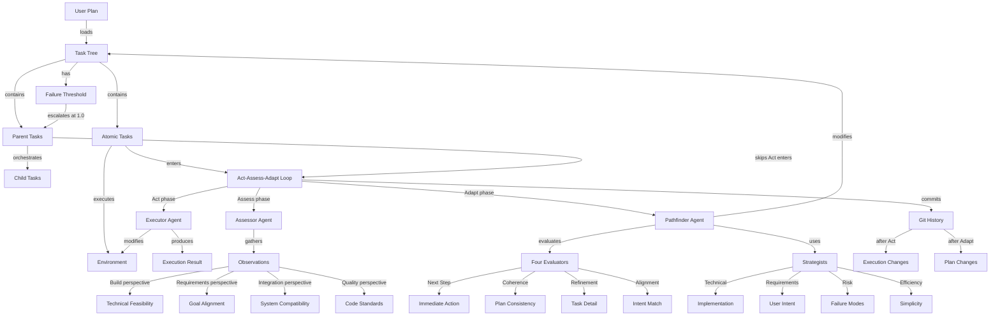

# Task Execution Framework (TEF) Learning Materials

## TL;DR (5 bullets)

• **Core Loop**: Every task executes Act→Assess→Adapt cycles where atomic tasks modify the environment, all tasks get multi-perspective assessment, and the Pathfinder continuously refines the plan
• **Single Entry**: All tasks flow through ExecuteTask() enabling uniform error handling, audit trails, and recursive orchestration at any complexity level
• **Progressive Elaboration**: Tasks evolve from simple descriptions to complete specifications as they approach execution through "attention proximity"
• **Plan as Sand**: Plans are "trenches in sand" - probable paths easily redrawn as reality emerges, with continuous reconciliation between intent and discovery
• **Dual Distinction**: Atomic tasks (leaves) perform Act phase while parent tasks orchestrate children; both participate in Assess and Adapt for multi-level adaptation

## Concept Map (Mermaid)



## Glossary

- **Act Phase**: Execution step where atomic tasks modify the environment through the Executor agent
- **Adapt Phase**: Planning step where Pathfinder modifies the task tree based on assessments
- **Assess Phase**: Observation step gathering multi-perspective facts without making decisions
- **Atomic Task**: Leaf task with no children that performs actual environment changes
- **Attention Proximity**: Principle where tasks get refined with more detail as execution approaches
- **ExecuteTask**: Single-entry recursive function handling all task complexity levels
- **Failure Threshold**: Float (0.0-1.0) measuring task's tolerance before parent escalation
- **Observer**: Information-gathering module providing perspective-specific facts not decisions
- **Parent Task**: Task with children that orchestrates subtasks without direct execution
- **Pathfinder**: Navigation agent that searches for optimal plan modifications
- **Progressive Elaboration**: Evolution from simple descriptions to complete specifications
- **Strategist**: Specialized perspective within Pathfinder for decision synthesis
- **Task Tree**: Hierarchical JSON structure representing the entire project plan
- **Trench in Sand**: Metaphor for plans as easily revisable probable paths

## Worked Example

**Input**: Project to add dark mode to a settings page

```json
{
  "id": "dark-mode-project",
  "type": "parent",
  "description": "Add dark mode toggle to application settings",
  "failure_threshold": 0.0,
  "status": "pending",
  "children": [
    {
      "id": "task-001",
      "type": "atomic",
      "description": "Create dark mode toggle component",
      "failure_threshold": 0.0,
      "status": "pending"
    }
  ]
}
```

**Process Flow**:

1. **Load**: `execute_project_plan()` loads task tree from JSON
2. **Find**: `find_next_task()` identifies task-001 as next atomic task
3. **Act**: TaskExecutor creates `DarkModeToggle.jsx` component
   - Result: `{status: "success", files_changed: ["DarkModeToggle.jsx"], git_diff: "+export const DarkModeToggle..."}`
4. **Assess**: TaskAssessor evaluates from four perspectives
   - Build: "Component compiles successfully"
   - Requirements: "Toggle functionality implemented"
   - Integration: "Missing theme context integration"
   - Quality: "Needs accessibility attributes"
5. **Adapt**: Pathfinder evaluates and modifies plan
   - Intent Alignment: "Matches user goal for settings toggle"
   - Plan Coherence: "Need theme provider before component works"
   - Next Step: "Add theme context provider task"
   - Refinement: "Specify ARIA labels for accessibility"
6. **Update**: Tree modified with new task inserted before current
7. **Commit**: Git commits both execution and plan changes

**Output**: Modified task tree with theme provider task added, component created in environment

## Pitfalls & Gotchas

1. **Atomic vs Parent Confusion**: Parent tasks executing Act phase causes double-execution. Detect: Check for children before Act. Avoid: Only leaves execute.

2. **Missing User Intent**: Pathfinder drifts from original goals without reference. Detect: Plans become unrecognizable. Avoid: Preserve immutable user_intent reference.

3. **Assessment Decision Mixing**: Observers making decisions instead of gathering facts. Detect: Observers return "should" statements. Avoid: Emit state, not judgments.

4. **Infinite Refinement Loop**: Tasks perpetually refined without execution. Detect: Same task modified repeatedly. Avoid: Set refinement limits per task.

5. **Git Commit Flooding**: Every micro-change creates commit. Detect: Hundreds of commits per task. Avoid: Batch related changes in Adapt phase.

6. **Template Variable Mismatch**: Undefined variables in prompt templates. Detect: `$variable` appears in agent output. Avoid: Validate all template variables populated.

7. **Failure Threshold Starvation**: Task never escalates despite repeated failures. Detect: Task stuck at 0.9 threshold. Avoid: Ensure threshold increment reaches 1.0.

8. **Tree Update Race Conditions**: Concurrent modifications corrupt task tree. Detect: Tasks disappear or duplicate. Avoid: Synchronous tree updates only.

9. **Circular Task Dependencies**: Child depends on parent completion. Detect: Execution deadlock. Avoid: Validate dependency graph acyclic.

10. **Observer Timeout**: Long-running assessment blocks progress. Detect: Assess phase exceeds 30 seconds. Avoid: Set observer timeouts, run in parallel.

## Audio Scripts

### Quick Pass (3-5 min)

The Task Execution Framework transforms environments through continuous adaptation. [pause]

Picture a system that takes a project plan and makes it real. Not by following rigid steps, but by constantly learning and adjusting. [pause]

At its heart lives the Act-Assess-Adapt loop. Every task goes through this cycle. Atomic tasks - the leaves with no children - execute changes in the Act phase. Parent tasks skip Act but orchestrate their children. [pause]

After acting, we assess. Four observers gather facts: Build checks if it compiles. Requirements verifies goal alignment. Integration ensures system compatibility. Quality evaluates standards. These observers don't decide - they observe. [pause]

Then comes adaptation. The Pathfinder agent takes all observations and searches for the optimal path forward. It employs four evaluators: Next Step finds immediate actions. Coherence maintains plan consistency. Refinement adds needed detail. Alignment checks against original intent. [pause]

The magic is progressive elaboration. Tasks start as simple descriptions. As execution approaches, they gain detail through "attention proximity" - the closer you get, the more refined they become. [pause]

Everything flows through a single entry point: ExecuteTask. This enables consistent handling whether you're executing a simple function or orchestrating a complex system. [pause]

Plans aren't carved in stone - they're trenches in sand. Easily redrawn as reality emerges. The framework commits changes twice per cycle: after execution and after planning. Complete traceability. [pause]

This is TEF - where plans and reality continuously reconcile through structured adaptation.

### Deep Dive (12-18 min)

#### The Problem

Software projects fail when plans meet reality. Requirements hide complexity. Dependencies emerge unexpectedly. Edge cases multiply. Traditional execution assumes perfect foresight. [pause]

The Task Execution Framework solves this through continuous adaptation. Not reactive fixes - proactive reconciliation between intent and discovery. [pause]

#### Core Components

Three specialized agents orchestrate execution. The Executor performs environment changes - creating files, modifying code, running commands. Only atomic tasks use the Executor. [pause]

The Assessor gathers observations from multiple perspectives. Think of it as having four different experts examine the work. The Build observer checks compilation and technical feasibility. Requirements validates goal satisfaction. Integration ensures system compatibility. Quality evaluates maintainability. [pause]

The Pathfinder navigates the solution space. It doesn't just fix problems - it searches for optimal paths. Four evaluators guide its decisions. Next Step identifies immediate needs. Coherence maintains consistency across all tasks. Refinement adds detail where needed. Alignment ensures fidelity to original goals. [pause]

These agents communicate through structured templates. Variables get XML-wrapped for clarity. Responses use Pydantic models for type safety. Every interaction is deterministic and traceable. [pause]

#### Data Flow

A task tree represents your entire project. JSON structure with hierarchical tasks. Each task has an ID, type, description, and failure threshold. Parent tasks contain children. Atomic tasks contain implementation. [pause]

The main loop finds the next atomic task through depth-first traversal. If it's atomic, it executes. All tasks assess. All tasks adapt. The tree updates in place. Git commits capture each change. [pause]

Here's the critical distinction: atomic tasks modify the environment. Parent tasks orchestrate children. Both assess and adapt, enabling multi-level learning. A parent can revise its entire subtree based on child discoveries. [pause]

#### Core Invariants

Single entry through ExecuteTask maintains consistency. Every task follows the same path. Same error handling. Same audit trail. Same resource management. [pause]

Progressive elaboration ensures readiness. Tasks evolve from sketches to specifications. The closer to execution, the more detail. This "attention proximity" prevents premature optimization. [pause]

Observer separation maintains objectivity. Observers gather facts, not opinions. "The build failed with error X" not "we should fix the build." The Pathfinder interprets observations for decisions. [pause]

Failure thresholds enable graceful degradation. Starting at zero, increasing with failures. At one-point-zero, escalate to parent. Parents can reset thresholds with new approaches. No hard retry limits. [pause]

#### Trade-offs

Simplicity over sophistication. Two hundred lines of core code. No complex state machines. No machine learning. Deterministic behavior for debugging. [pause]

Adaptation over planning. Imperfect initial plans are expected. Discovery drives refinement. Reality shapes plans as much as plans shape reality. This requires accepting uncertainty. [pause]

Traceability over performance. Dual git commits per cycle. Complete audit trails. Every decision recorded. This creates commit volume but enables forensic debugging. [pause]

#### Concrete Example

Let's trace adding authentication to an API. The initial task: "Add JWT authentication to user endpoints." [pause]

Find next task returns our atomic authentication task. The Executor begins implementation. Creates auth middleware. Adds JWT validation. Modifies three endpoints. Git diff captured. [pause]

Assessment begins. Build observer: "Compilation successful, all tests pass." Requirements: "JWT validation implemented but refresh tokens missing." Integration: "Breaking change for existing clients." Quality: "Missing rate limiting." [pause]

The Pathfinder evaluates. Intent alignment: "Partial - security added but compatibility broken." Coherence: "Need migration strategy for existing clients." Next step: "Add backwards compatibility layer." Refinement: "Specify refresh token requirements." [pause]

Pathfinder modifies the tree. Inserts compatibility task before current. Adds refresh token subtask. Updates current task description with rate limiting notes. Tree updated. Git commit: "ADAPT: Added compatibility requirements." [pause]

Next iteration. Compatibility task executes. Creates version detection. Dual auth support implemented. Assessment shows all perspectives satisfied. Task marked complete. [pause]

#### Common Pitfalls

Observers making decisions breaks separation of concerns. Watch for "should" or "must" in observations. Observers report state, Pathfinder decides. [pause]

Missing user intent causes drift. Without the north star, plans wander. Always preserve original specifications separately from working plans. [pause]

Parent tasks executing Act phase causes double-execution. Remember: only atomic tasks modify the environment. Parents orchestrate. [pause]

Infinite refinement without execution. Set limits on task refinement. Sometimes good enough must be good enough. [pause]

Template variable mismatches. Undefined variables appear in output as dollar-variable. Always validate template variables before rendering. [pause]

#### System Recap

The Task Execution Framework enables sophisticated adaptation through simple, thorough re-evaluation. [pause]

Act-Assess-Adapt at every level. Single entry for consistency. Progressive elaboration for readiness. Observer separation for objectivity. Plans as trenches in sand. [pause]

Not just execution - continuous reconciliation between intent and reality. The framework doesn't fight discovery - it embraces it. [pause]

This is software development as exploration. Where every step teaches, every assessment informs, every adaptation improves. Not perfect planning - perfect learning.

### SSML Versions

#### Quick Pass SSML
```xml
<speak>
The Task Execution Framework transforms environments through continuous adaptation. <break time="1s"/>

Picture a system that takes a project plan and makes it real. Not by following rigid steps, but by constantly learning and adjusting. <break time="1s"/>

At its heart lives the Act-Assess-Adapt loop. Every task goes through this cycle. Atomic tasks - the leaves with no children - execute changes in the Act phase. Parent tasks skip Act but orchestrate their children. <break time="1s"/>

After acting, we assess. Four observers gather facts: Build checks if it compiles. Requirements verifies goal alignment. Integration ensures system compatibility. Quality evaluates standards. These observers don't decide - they observe. <break time="1s"/>

Then comes adaptation. The Pathfinder agent takes all observations and searches for the optimal path forward. It employs four evaluators: Next Step finds immediate actions. Coherence maintains plan consistency. Refinement adds needed detail. Alignment checks against original intent. <break time="1s"/>

The magic is progressive elaboration. Tasks start as simple descriptions. As execution approaches, they gain detail through "attention proximity" - the closer you get, the more refined they become. <break time="1s"/>

Everything flows through a single entry point: ExecuteTask. This enables consistent handling whether you're executing a simple function or orchestrating a complex system. <break time="1s"/>

Plans aren't carved in stone - they're trenches in sand. Easily redrawn as reality emerges. The framework commits changes twice per cycle: after execution and after planning. Complete traceability. <break time="1s"/>

This is TEF - where plans and reality continuously reconcile through structured adaptation.
</speak>
```

#### Deep Dive SSML
```xml
<speak>
<emphasis level="strong">The Problem</emphasis> <break time="1s"/>

Software projects fail when plans meet reality. Requirements hide complexity. Dependencies emerge unexpectedly. Edge cases multiply. Traditional execution assumes perfect foresight. <break time="1s"/>

The Task Execution Framework solves this through continuous adaptation. Not reactive fixes - proactive reconciliation between intent and discovery. <break time="1.5s"/>

<emphasis level="strong">Core Components</emphasis> <break time="1s"/>

Three specialized agents orchestrate execution. The Executor performs environment changes - creating files, modifying code, running commands. Only atomic tasks use the Executor. <break time="1s"/>

The Assessor gathers observations from multiple perspectives. Think of it as having four different experts examine the work. The Build observer checks compilation and technical feasibility. Requirements validates goal satisfaction. Integration ensures system compatibility. Quality evaluates maintainability. <break time="1s"/>

The Pathfinder navigates the solution space. It doesn't just fix problems - it searches for optimal paths. Four evaluators guide its decisions. Next Step identifies immediate needs. Coherence maintains consistency across all tasks. Refinement adds detail where needed. Alignment ensures fidelity to original goals. <break time="1s"/>

These agents communicate through structured templates. Variables get XML-wrapped for clarity. Responses use Pydantic models for type safety. Every interaction is deterministic and traceable. <break time="1.5s"/>

<emphasis level="strong">Data Flow</emphasis> <break time="1s"/>

A task tree represents your entire project. JSON structure with hierarchical tasks. Each task has an ID, type, description, and failure threshold. Parent tasks contain children. Atomic tasks contain implementation. <break time="1s"/>

The main loop finds the next atomic task through depth-first traversal. If it's atomic, it executes. All tasks assess. All tasks adapt. The tree updates in place. Git commits capture each change. <break time="1s"/>

Here's the critical distinction: atomic tasks modify the environment. Parent tasks orchestrate children. Both assess and adapt, enabling multi-level learning. A parent can revise its entire subtree based on child discoveries. <break time="1.5s"/>

<emphasis level="strong">Core Invariants</emphasis> <break time="1s"/>

Single entry through ExecuteTask maintains consistency. Every task follows the same path. Same error handling. Same audit trail. Same resource management. <break time="1s"/>

Progressive elaboration ensures readiness. Tasks evolve from sketches to specifications. The closer to execution, the more detail. This "attention proximity" prevents premature optimization. <break time="1s"/>

Observer separation maintains objectivity. Observers gather facts, not opinions. "The build failed with error X" not "we should fix the build." The Pathfinder interprets observations for decisions. <break time="1s"/>

Failure thresholds enable graceful degradation. Starting at zero, increasing with failures. At one-point-zero, escalate to parent. Parents can reset thresholds with new approaches. No hard retry limits. <break time="1.5s"/>

<emphasis level="strong">Trade-offs</emphasis> <break time="1s"/>

Simplicity over sophistication. Two hundred lines of core code. No complex state machines. No machine learning. Deterministic behavior for debugging. <break time="1s"/>

Adaptation over planning. Imperfect initial plans are expected. Discovery drives refinement. Reality shapes plans as much as plans shape reality. This requires accepting uncertainty. <break time="1s"/>

Traceability over performance. Dual git commits per cycle. Complete audit trails. Every decision recorded. This creates commit volume but enables forensic debugging. <break time="1.5s"/>

<emphasis level="strong">Concrete Example</emphasis> <break time="1s"/>

Let's trace adding authentication to an API. The initial task: "Add JWT authentication to user endpoints." <break time="1s"/>

Find next task returns our atomic authentication task. The Executor begins implementation. Creates auth middleware. Adds JWT validation. Modifies three endpoints. Git diff captured. <break time="1s"/>

Assessment begins. Build observer: "Compilation successful, all tests pass." Requirements: "JWT validation implemented but refresh tokens missing." Integration: "Breaking change for existing clients." Quality: "Missing rate limiting." <break time="1s"/>

The Pathfinder evaluates. Intent alignment: "Partial - security added but compatibility broken." Coherence: "Need migration strategy for existing clients." Next step: "Add backwards compatibility layer." Refinement: "Specify refresh token requirements." <break time="1s"/>

Pathfinder modifies the tree. Inserts compatibility task before current. Adds refresh token subtask. Updates current task description with rate limiting notes. Tree updated. Git commit: "ADAPT: Added compatibility requirements." <break time="1s"/>

Next iteration. Compatibility task executes. Creates version detection. Dual auth support implemented. Assessment shows all perspectives satisfied. Task marked complete. <break time="1.5s"/>

<emphasis level="strong">Common Pitfalls</emphasis> <break time="1s"/>

Observers making decisions breaks separation of concerns. Watch for "should" or "must" in observations. Observers report state, Pathfinder decides. <break time="1s"/>

Missing user intent causes drift. Without the north star, plans wander. Always preserve original specifications separately from working plans. <break time="1s"/>

Parent tasks executing Act phase causes double-execution. Remember: only atomic tasks modify the environment. Parents orchestrate. <break time="1s"/>

Infinite refinement without execution. Set limits on task refinement. Sometimes good enough must be good enough. <break time="1s"/>

Template variable mismatches. Undefined variables appear in output as dollar-variable. Always validate template variables before rendering. <break time="1.5s"/>

<emphasis level="strong">System Recap</emphasis> <break time="1s"/>

The Task Execution Framework enables sophisticated adaptation through simple, thorough re-evaluation. <break time="1s"/>

Act-Assess-Adapt at every level. Single entry for consistency. Progressive elaboration for readiness. Observer separation for objectivity. Plans as trenches in sand. <break time="1s"/>

Not just execution - continuous reconciliation between intent and reality. The framework doesn't fight discovery - it embraces it. <break time="1s"/>

This is software development as exploration. Where every step teaches, every assessment informs, every adaptation improves. Not perfect planning - perfect learning.
</speak>
```

## Active Recall

### Short-Answer Questions

1. **Q**: What is the fundamental difference between atomic and parent tasks in the Act phase?
   **A**: Atomic tasks execute environment changes; parent tasks skip Act and only orchestrate children

2. **Q**: What are the four perspectives used during the Assess phase?
   **A**: Build (technical feasibility), Requirements (goal alignment), Integration (system compatibility), Quality (code standards)

3. **Q**: Why do observers emit state rather than decisions?
   **A**: Separation of concerns - observers gather objective facts while Pathfinder interprets for decisions

4. **Q**: What is "attention proximity" in progressive elaboration?
   **A**: Tasks get refined with more detail as they approach execution time

5. **Q**: What are the four evaluators employed by the Pathfinder during Adapt?
   **A**: Next Step, Plan Coherence, Task Refinement, Intent Alignment

6. **Q**: When does the framework create git commits?
   **A**: Twice per cycle: after Act phase (execution changes) and after Adapt phase (plan changes)

7. **Q**: What happens when a task's failure threshold reaches 1.0?
   **A**: The task escalates to its parent for alternative approaches

8. **Q**: Why is ExecuteTask the single entry point for all tasks?
   **A**: Ensures uniform error handling, audit trails, and resource management

9. **Q**: What does "trenches in sand" mean for plans?
   **A**: Plans are probable paths that are easily revised as better paths emerge

10. **Q**: How do strategists differ from observers?
    **A**: Strategists synthesize decisions within Pathfinder; observers gather facts during assessment

### Cloze Cards

1. The core control loop consists of [...], [...], and [...] phases executed at every task level.
   Answer: Act, Assess, Adapt

2. Only [...] tasks execute the Act phase, while [...] tasks orchestrate their children.
   Answer: atomic, parent

3. The [...] agent performs environment modifications during the Act phase.
   Answer: Executor (or TaskExecutor)

4. During Assess, the [...] observer checks compilation and technical feasibility.
   Answer: Build

5. The [...] is the navigation agent that searches for optimal plan modifications.
   Answer: Pathfinder

6. Tasks evolve from simple descriptions to complete specifications through [...].
   Answer: progressive elaboration

7. The principle where tasks get more detail as execution approaches is called [...].
   Answer: attention proximity

8. All tasks flow through the [...] function for uniform handling.
   Answer: ExecuteTask

9. Plans are treated as "[...]" - easily created and revised probable paths.
   Answer: trenches in sand

10. The [...] evaluator checks how well the current plan aligns with original goals.
    Answer: Intent Alignment

11. Failure thresholds range from [...] to [...], escalating at the maximum.
    Answer: 0.0, 1.0

12. The framework creates git commits after [...] and after [...] phases.
    Answer: Act, Adapt

13. The [...] perspective validates goal satisfaction and acceptance criteria.
    Answer: Requirements

14. Observers emit [...] rather than decisions to maintain objectivity.
    Answer: state (or facts/observations)

15. The four strategists are Technical, Requirements, [...], and [...].
    Answer: Risk, Efficiency

### Anki Export

```
What is the core control loop of TEF?	Act→Assess→Adapt	TEF::Core
Which tasks execute the Act phase?	Only atomic tasks (leaves with no children)	TEF::Tasks
What do parent tasks do instead of Act?	Orchestrate their children	TEF::Tasks
What are the four Assess phase observers?	Build, Requirements, Integration, Quality	TEF::Assessment
What are the four Adapt phase evaluators?	Next Step, Plan Coherence, Task Refinement, Intent Alignment	TEF::Adaptation
What is progressive elaboration?	Evolution from simple descriptions to complete specifications	TEF::Concepts
What is attention proximity?	Tasks get refined with more detail as execution approaches	TEF::Concepts
Why use ExecuteTask as single entry?	Uniform error handling, audit trails, resource management	TEF::Architecture
What are plans as "trenches in sand"?	Easily revisable probable paths	TEF::Philosophy
When does TEF create git commits?	After Act (execution) and Adapt (planning) phases	TEF::GitIntegration
What is the failure threshold range?	0.0 to 1.0	TEF::ErrorHandling
What happens at failure threshold 1.0?	Task escalates to parent	TEF::ErrorHandling
What do observers emit?	State/facts, not decisions	TEF::Observers
Who makes decisions from observations?	Pathfinder agent	TEF::Agents
What are the four strategists?	Technical, Requirements, Risk, Efficiency	TEF::Strategists
```

## Cheat Sheet

### Core Concepts
- **Act→Assess→Adapt**: Universal control loop at every level
- **Atomic vs Parent**: Only leaves execute; parents orchestrate
- **Single Entry**: ExecuteTask() handles all complexity uniformly
- **Progressive Elaboration**: Simple→detailed as execution nears
- **Plans as Sand**: Easily revised probable paths, not rigid specs

### The Three Phases
**Act (Atomic Only)**
- Executor agent modifies environment
- Creates files, changes code, runs commands
- Produces ExecutionResult with git diff

**Assess (All Tasks)**
- Four observers gather facts:
  - Build: Technical feasibility
  - Requirements: Goal alignment
  - Integration: System compatibility
  - Quality: Code standards
- Observers emit state, not decisions

**Adapt (All Tasks)**
- Pathfinder searches for optimal modifications
- Four evaluators guide decisions:
  - Next Step: Immediate actions
  - Coherence: Plan consistency
  - Refinement: Task detail needs
  - Alignment: Intent matching
- Strategists synthesize: Technical, Requirements, Risk, Efficiency

### Key Mechanisms
- **Failure Threshold**: 0.0→1.0, escalates at max
- **Git Commits**: After Act AND Adapt for full traceability
- **Task Tree**: Hierarchical JSON with recursive structure
- **Templates**: Structured prompts with XML-wrapped variables
- **Pydantic Models**: Type-safe agent communication

### Critical Distinctions
- Observers gather; Pathfinder decides
- Atomic tasks act; parent tasks orchestrate
- User intent immutable; working plan evolves
- Assessment observes actions; Adaptation evaluates plans

### Implementation Files
- `tef_light.py`: Main orchestrator (202 lines)
- `models.py`: Pydantic data structures
- `templates.py`: Prompt management
- `claude_agents/`: Executor, Assessor, Pathfinder

### Common Pitfalls
1. Parent executing Act → double-execution
2. Observers deciding → breaks separation
3. Missing user intent → plan drift
4. Infinite refinement → no progress
5. Template variables undefined → $variable in output

## Assumptions & Open Questions

### Assumptions Made
1. **Claude SDK availability**: Assumes Anthropic Claude API access with structured output support
2. **Git environment**: Assumes git repository initialized in working directory
3. **JSON task format**: Assumes task trees follow the specified schema
4. **Sequential execution**: Assumes synchronous task processing (no parallel execution yet)
5. **Python 3.8+**: Assumes modern Python with Pydantic support

### Open Questions

1. **User Intent Preservation**: How exactly should immutable intent be stored and referenced? Current implementation doesn't fully separate user_intent/ from working_plan/

2. **Parallel Execution**: How should atomic tasks run concurrently while maintaining tree consistency?

3. **Observer Timeouts**: What timeout values prevent assessment blocking while allowing thorough analysis?

4. **Failure Threshold Increments**: Should increment be fixed (0.2) or adaptive based on failure type?

5. **Template Variable Validation**: How to ensure all required variables populated before agent calls?

6. **Tree Merge Conflicts**: How to handle when Pathfinder modifies already-changed portions of tree?

7. **Cross-Repository Coordination**: How would multi-repo projects share state and coordinate?

8. **Performance Boundaries**: At what tree size does full re-evaluation become prohibitive?

9. **Strategist Weights**: Should different strategists have different influence on decisions?

10. **Rollback Mechanisms**: How to undo executed changes when assessment reveals critical issues?

### Evidence That Would Resolve
- **Production usage data**: Real project executions showing bottlenecks
- **Tree size benchmarks**: Performance metrics at various scales
- **Failure pattern analysis**: Common failure modes from actual runs
- **User studies**: How developers actually specify intent
- **Concurrent execution traces**: Race conditions in parallel task execution

---

```json
{
  "sections": [
    {"id":"tldr","title":"TLDR"},
    {"id":"concept_map","title":"Concept Map","format":"mermaid"},
    {"id":"glossary","title":"Glossary","format":"markdown"},
    {"id":"worked_example","title":"Worked Example","format":"markdown"},
    {"id":"pitfalls","title":"Pitfalls & Gotchas","format":"markdown"},
    {"id":"audio_quick","title":"Quick Pass Script","format":"text|ssml"},
    {"id":"audio_deep","title":"Deep Dive Script","format":"text|ssml"},
    {"id":"active_recall","title":"Active Recall","format":"markdown"},
    {"id":"anki","title":"Anki Export","format":"tsv"},
    {"id":"cheat","title":"Cheat Sheet","format":"markdown"},
    {"id":"assumptions","title":"Assumptions & Open Questions","format":"markdown"}
  ]
}
```